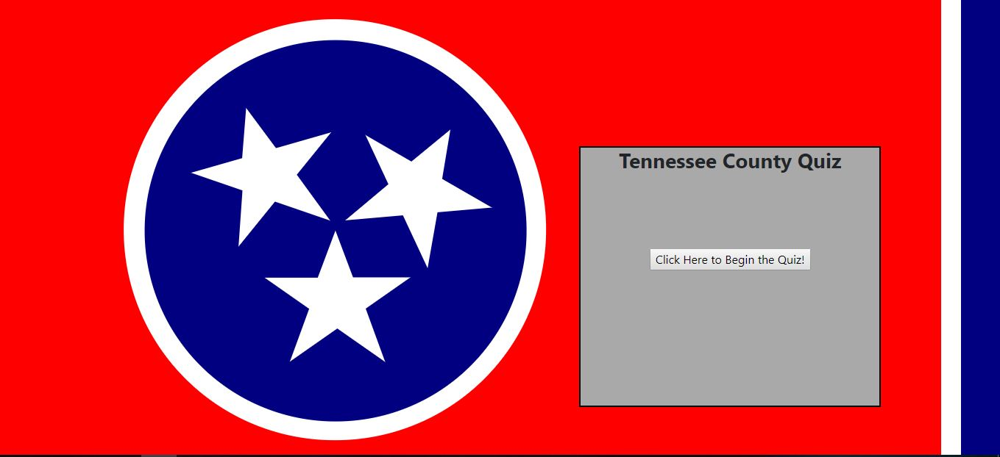

# Tennessee Trivia
Tennessee Trivia is a simple jQuery trivia that tests the users knowledge of Tennessee's counties history and landmarks.  The user is asked 10 questions and is provided 30 seconds to answer each question.  After each question, the answer is rendered at the bottom of the box for the user to learn more about Tennessee. At the end, the user's score is tabulated and provided. 

## How To Use Application
[Link to Deployed TriviaGame](https://rsuttles58.github.io/Triviagame/)

## Technology Used
*Javascript
*jQuery
*HTML
*CSS-Heavily Customized

## Project Technical Specs
This simple trivia game uses jQuery heavily to render the changing questions to the page.  Additionally, timers are used to manage the time allowance for each question and to move to the next question if no answer is chosen.  

The Tennessee state flag was custom coded in plain CSS.  I greatly enjoyed the challenge of trying to replicate the Tennessee state flag.  

